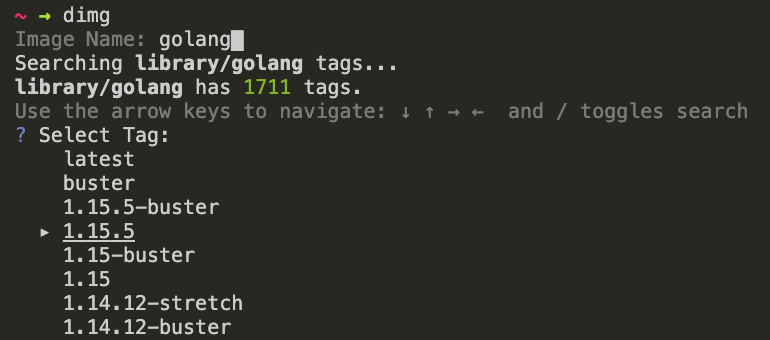
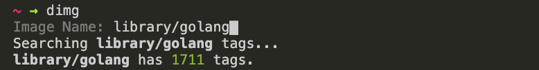

# dimg

CLI to search and pull images from Docker Hub.

## Download and Install

Download and Install with [Homebrew](https://brew.sh/).
```bash
$ brew install kohbis/dimg/dimg
```

## Usage

```bash
$ dimg
```

You can search image with name and pull specific image with tag.



Default repogitory is official `library`.
If You want specify repogitory, input Image Name like `${repo_name}/${image_name}`.



## Appendix

[Docker Advent Calendar 2019 22日目](https://qiita.com/kohbis/items/684b546d9e75e8b2b80b)
